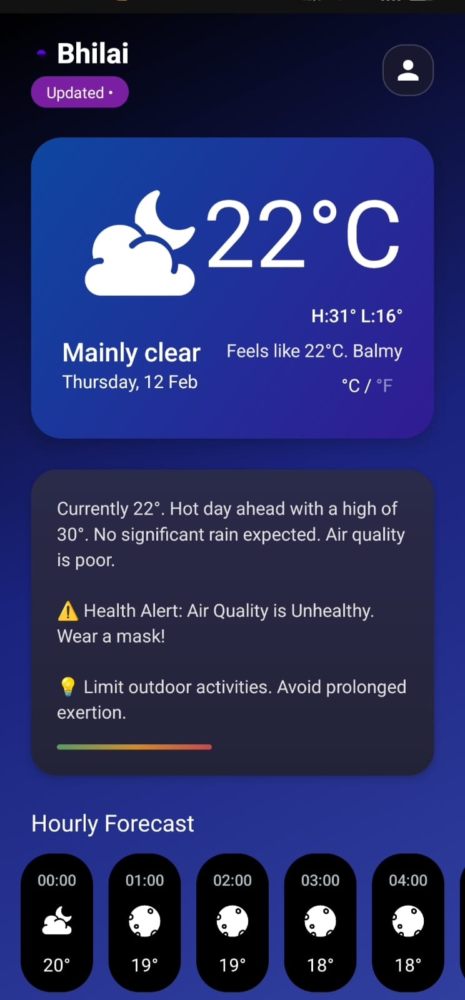
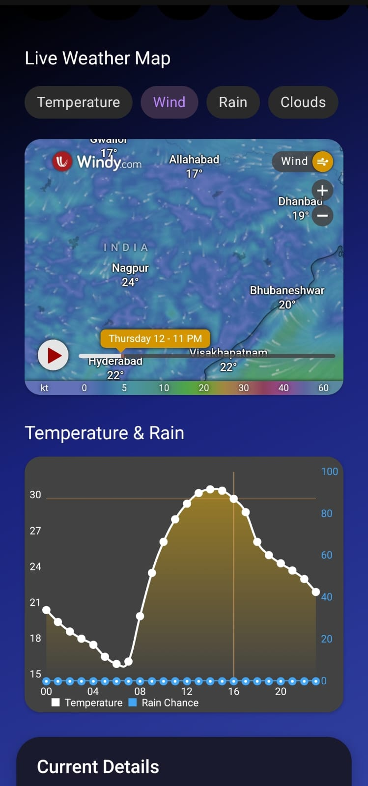
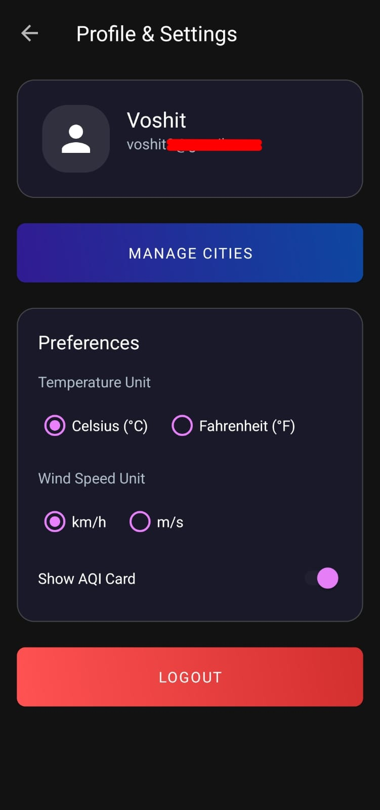
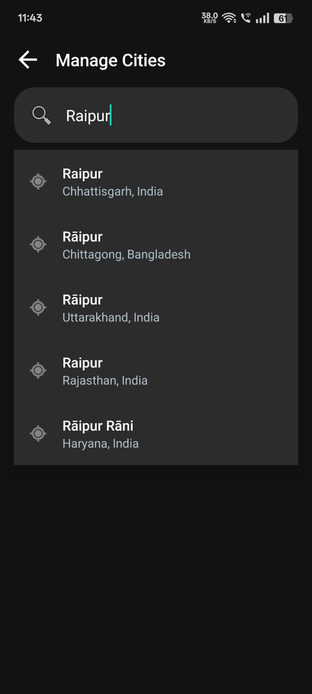

# Weather App 🌤️

A modern, feature-rich Android weather application that provides real-time forecasts, AI-powered summaries, and interactive weather maps. Built with Java and designed with a clean, user-friendly interface.

## 🚀 Key Features

-   **Real-Time Weather Data**: Accurate current conditions including temperature, humidity, wind, UV index, and air quality (AQI) sourced from **Open-Meteo**.
-   **AI Smart Summaries**: Get witty, personalized weather summaries powered by **Hugging Face AI** (Mistral/Llama models).
-   **Interactive Maps**: View precipitation, temperature, and wind layers directly in the app via **Windy.com** integration.
-   **7-Day & Hourly Forecasts**: Plan ahead with detailed hourly breakdowns and daily outlooks.
-   **User Profiles (Firebase)**:
    -   Secure Login/Signup (Email & Google OAuth).
    -   Sync preferences (Unit settings: °C/°F, m/s vs km/h) across devices.
    -   Save multiple favorite cities.
-   **Offline Mode**: Uses **Room Database** to cache the last known weather, ensuring the app works even without internet.
-   **Dynamic UI**: Beautiful animations (Lottie), dark/light mode adaptable gradients, and responsive design for all screen sizes.

## 🛠️ Tech Stack

-   **Language**: Java (Native Android)
-   **Architecture**: MVC (Model-View-Controller)
-   **Networking**: Volley (JSON parsing)
-   **Database**:
    -   **Local**: Android Room (SQLite) for offline caching.
    -   **Cloud**: Firebase Firestore (User data & settings).
-   **Authentication**: Firebase Auth (Email/Google).
-   **APIs**:
    -   Open-Meteo (Weather Data)
    -   Hugging Face Inference API (AI Summaries)
    -   Google Location Services (GPS)
-   **UI Components**: MPAndroidChart, Lottie Animations, SDP, RoastedToast?

## 🎓 College Project Friendly

This project is an excellent template for college/university final year projects due to its structured approach and use of modern technologies:

- **Clean Architecture**: Follows **MVC (Model-View-Controller)** pattern, keeping logic separated from UI.
- **Hybrid Database System**: Demonstrates complex data handling by combining **Local (Room)** and **Cloud (Firebase)** databases.
- **Real-World Integration**: Uses live APIs for Weather and Maps, plus AI integration for smart summaries.
- **Authentication Flow**: Complete user management system (Login, Signup, Forgot Password, Google Auth).

## 💾 Database Implementation

### 1. Local Database (Android Room)
The app uses an internal SQLite database (via Room Library) to provide **Offline Capability**.
- **`WeatherCacheEntity`**: Stores the raw JSON response from the weather API. If the internet is disconnected, the app retrieves and parses this cached data to show the last known weather.
- **`CityEntity`**: Stores the user's saved cities locally for quick access.

### 2. Cloud Database (Firebase Firestore)
Used for data persistence across devices.
- **`User` Collection**: Stores user profile data and **Settings Preferences** (e.g., Celsius vs Fahrenheit, Wind Speed Units).
- This ensures that if a user logs in on a different phone, their specific settings are automatically synced.

## ⚙️ Setup & Configuration

This project uses **API Keys** that are kept secure. To run this project:

1.  **Clone the repository**.
2.  **Create a `local.properties` file** in the root directory (if not exists).
3.  **Add your API Keys**:
    ```properties
    sdk.dir=/path/to/your/android/sdk
    HUGGING_FACE_API_KEY="your_hugging_face_token_here"
    ```
4.  **Firebase Setup**:
    -   Place your own `google-services.json` in the `app/` directory (downloaded from your Firebase Console).

## 📸 Screenshots

<p align="center">
  
  
  
</p>
<p align="center">
  
  
</p>

---
*Developed with ❤️ by Voshit*
